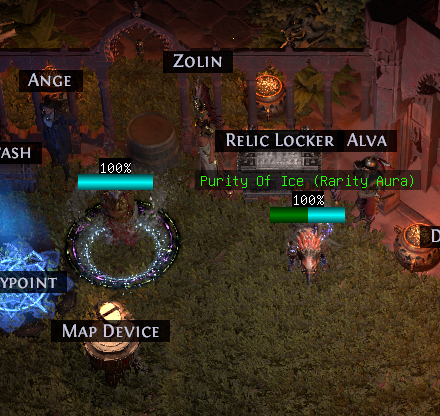
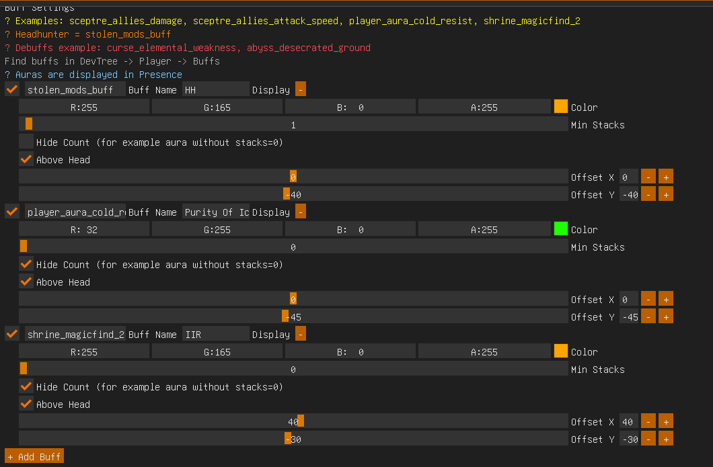

## ShowBuffs_PoE2 (ExileCore2)

Lightweight ExileCore2 plugin to display selected player buffs/debuffs. Supports head-anchored or fixed-screen positions, background, and text scaling.

### Install
- Copy the folder `ShowBuffs_PoE2` into `ExileCore2/Plugins/Source/`.
- Run the HUD (ExileCore2) — it will auto-build the plugin.

### Configure
- Add buff names from DevTree → Player → Buffs.
- Examples: `stolen_mods_buff` (Headhunter), `player_aura_cold_resist`, `shrine_magicfind_2`.
- Debuffs: `curse_elemental_weakness`, `abyss_desecrated_ground`.
- For auras without stacks: set Min Stacks = 0 and enable Hide Count.

### Screenshots

